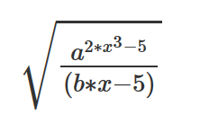
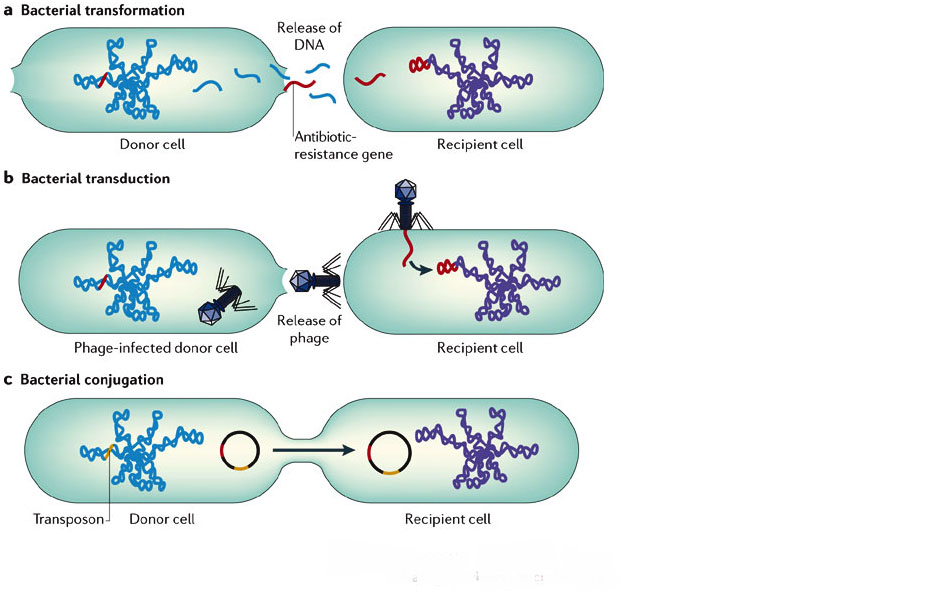
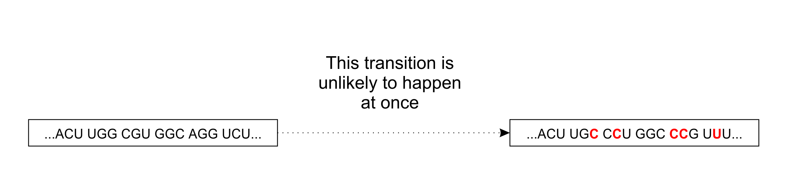
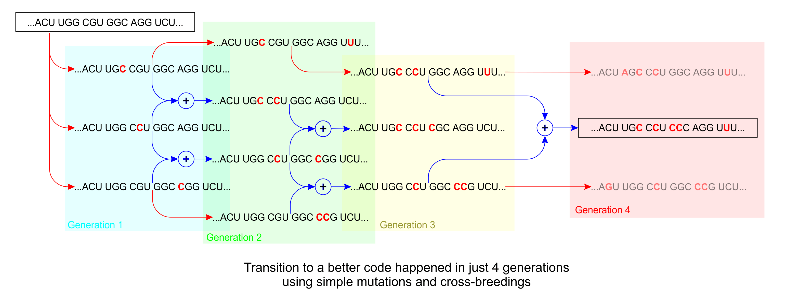
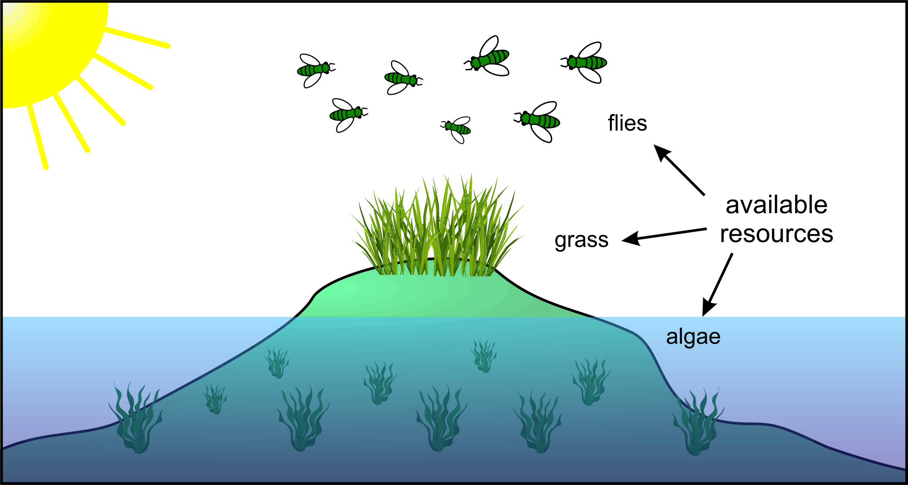
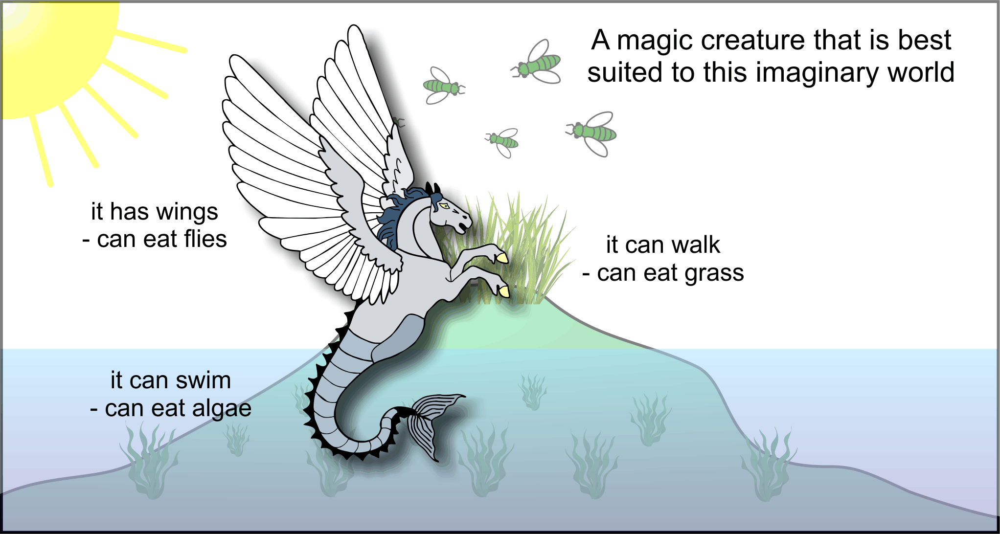
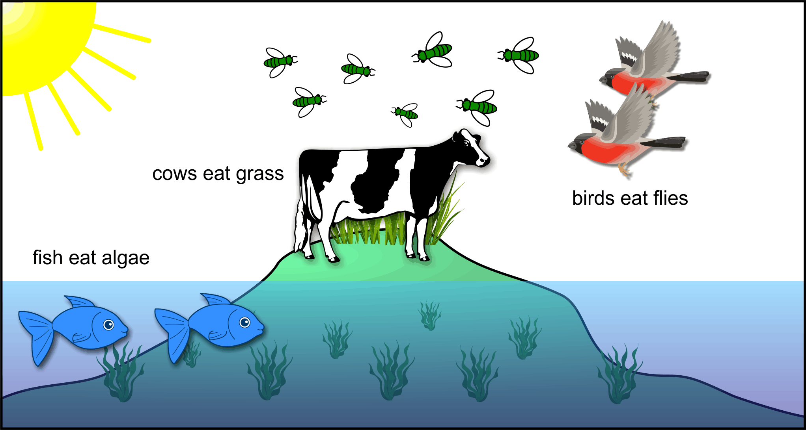
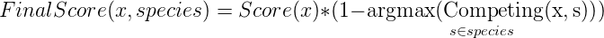

<p align="left">
    <a href="https://opensource.org/licenses/MIT">
        </a> &nbsp;
</p>

# QGEN Project - Competing Genetic Algorithm

## Abstract

In this article I describe **Competing Genetic Algorithm** that was created during my work on **QGEN Project**.

It was a project for the task of finding new profitable _trading strategies_ in a financial market.

In this project by _trading strategy_ I mean: a **mathematical formula** that uses some datasets of past market data
and produces a number.
If the number is positive we should trade **LONG** for a given instrument.
If it is negative - we should trade **SHORT**.
Otherwise - **CLOSE** any position.

At first I describe well known **Genetic Algorithm** in details.

Then I show it's limitations for tasks of particular kind,
**when you can expect many different good solutions**.
In this case a simple Genetic Algorithm will most probably stuck in a local optimum with one result.

Using analogy with some imaginary example I show the way to solve this problem: **competition for resources**.

Then I describe the proposed **Competing Genetic Algorithm**.
It's main principles are:
- Evolve several species in parallel, each with its own population.
- Make species compete for resources with each other.
This is achieved by adding a competing penalty (or regularizing) term into scoring function.


## Genetic Algorithm

[Genetic Algorithm](https://en.wikipedia.org/wiki/Genetic_algorithm) is well known since 1960.
It is used in optimization and search problems.

Particularly this project is a _search problem_.
There is enormous space of all possible trading strategies, some of which are profitable, others are not.

Brute-force search through this space seems impossible.

This is a good task for Genetic Algorithm if we manage to setup all conditions for it to work.

Genetic algorithm requires several conditions to work:
1. You **must** specify how to write down your formula as a sequence of 'symbols'.
 Either of fixed or variable length.
2. Most important: you **must** specify the scoring (or fitness) function for any sequence.
3. You **must** specify _mutate_ operation for any such sequence.
4. You **may** also specify _crossover_ operation for any two (three, four, ...) such sequences.

As you will see later a _sequence_ is not necessarily a _string_ and
 _symbols_ could be other than _letters_.

All living creatures on Earth have the same building 'symbols' for their DNA 'sequences':
- Adenine (A)
- Thymine (T)
- Guanine (G)
- Cytosine (C)

Four 'letters': A, T, G, C - are combined into sequences of any length that describe all organisms of our planet.

Why only four? Nobody knows... I bet it happened by chance!

**But we are not obliged to repeat the same limitations for our simulated evolution!**
(Thanks to my friend Eldar Mukhamedzyanov for this idea)  

We don't need to emulate **chromosomes**, **start/stop codons**, **complementary mRNA strands**, or even **codons** themselves!
Instead we can use **array or list** as a _sequence_ and use **keywords** as _symbols_.

### Formula as sequence

As you know, any formula can be written as a sequence of symbols.
Take, for example, a formula in LaTex format:
```
\sqrt{ \frac{ a ^ {2*x^3 - 5} } {(b*x - 5)}}
```

Which is equivalent of:



The problem with such string is in **parenthesis**.
They make it hard to _mutate_ or _crossover_ sequences.
As you can't simply change any symbol in string in any place or dissect sequence at any random place.

Luckily there is a solution - [reverse polish notation](https://en.wikipedia.org/wiki/Reverse_Polish_notation).
It helps to get rid of parenthesis.

With it the formula sequence looks like this:
```
a 2 x 3 ^ * 5 - ^ b x * 5 - / sqrt
```

A good example of polish notation usage is the [Postscript](https://en.wikipedia.org/wiki/PostScript) language,
which you implicitly evoke every time when reading PDF file.

This language also introduced **stack** as a way to get rid of variables.
Let's see how our formula could look in a postscript-like language:

```
push a
push 2
push x
push 3
pow
mul
push 5
sub
pow
push b
push x
mul
push 5
sub
div
sqrt
```

After execution there will be one item on a stack, containing the result of this formula.

The same principle is used in this project.
In [`syntax.lua`](syntax.lua) you may find sequence generation, mutation and cross-breeding operations.
And in [`processor.lua`](processor.lua) you may find all operations.

> Note: each line here should be treated like one **symbol**.
> For instance, when mutate, you can change `pow` to `add` or `mul`,
> but not `pow` to `poZ`.
> Now you understand why I'm using **sequences**, not **strings**.

I don't use `push` command for operands like `a`, `b` or `x`. I use `Val` instead.
While constants are simply written without any `push` or `Val`.
I had some reasons to do it this way:

```
a Val 2 x Val 3 Pow Mul 5 Sub Pow b Val x Val Mul 5 Sub Div Sqrt
```

The string above should be treated like a sequence, a list of keywords.
Each keyword representing a _symbol_, recognizable by the syntax **processor**.

### Datasets

Instead of `a`, `b` and `x` in the previous example we need to operate some real market data.

This data in most cases comes as a time series.

That is why I use **vectors** as operands.
Where first element of vector is the earliest one, and the last element is the newest one.

**Datasets** of past market data are as follows:
  - `po`: vector of open prices for intervals (10min, 1hour, 1day)
  - `ph`: vector of highest prices for intervals (10min, 1hour, 1day)
  - `pl`: vector of lowest prices for intervals (10min, 1hour, 1day)
  - `pc`: vector of close prices for intervals (10min, 1hour, 1day)
  - `ptr`: vector of price true range at intervals (10min, 1hour, 1day)
  - `vwap`: vector of Volume-Weighted-Average-Prices for intervals (10min, 1hour, 1day)
  - `vol`: vector of open prices for intervals (10min, 1hour, 1day)
  - `time`: vector of close times for intervals (10min, 1hour), where each value is in [0..1]
    such that 0 = start of of trading session, 1 = end of trading session.

For more details dig into [`data.lua`](data.lua).

### Operations

To build up any formula we need some **operations**.
All operations could be divided into several categories:
- operations on a single operand
- operations on two operands
- stack control and other special operations

List of single operand operations: `Delta`, `Min`, `Max`, `Sum`, `Prod`, `Rank`, `iRank`, `Std`, `SMA`, `WMA`,
 `Neg`, `Abs`, `Sign`, `Exp`, `Log`.

List of two operands operations: `Add`, `Sub`, `Mul`, `Div`, `Mod`, `Pow`, `Min2`, `Max2`, `Covar`.

List of stack control and other special operations: `Swap`, `Dup`, `Rep`, `RepN`, `RepM`, `If`, `Lt`, `Lte`, `Gt`, `Gte`.

**Why there are so many operations?**

Of course, some operations could be implemented as a sequence of other basic operations.
For instance: `x 5 *` can be written as `x x x x x + + + +`.

But my experiments show that it takes much longer time for genetic algorithm to get to solution
when there are fewer operations possible.
**The longer the target sequence - the lower the probability to get it randomly.**

It seems reasonable to have a good variety of operations.
So your algorithm could easily find new solutions.

For details you are encouraged to dig inside [`processor.lua`](processor.lua).

### Library of Sequences

I also developed additional approach to speed up evolution process.
Some sequences are too large to wait for evolution to create them,
but they _seem to be useful_ in many trading strategies.

For example, the following sequence calculates body of candle, i.e. `|close_price - open_price|`:
```
pc Val po Val Sub Abs
```

Following example calculates the upper shadow of a candles:
```
ph Val po Val Sub ph Val pc Val Sub Min2
```

Next example acts like a filter that keeps only the first values of each trading sessions,
zeroing other values out:
```
I time Delta 0 Lt Mul
``` 

I came to a solution when in some rare cases instead of a regular _mutate_ operation
genetic algorithm **inserts random record from the library into a sequence**.

This approach is wide spread in nature. As, for example,
[antimicrobial resistance](https://en.wikipedia.org/wiki/Antimicrobial_resistance)
could be caused by
[horizontal gene transfer](https://en.wikipedia.org/wiki/Horizontal_gene_transfer).
In this process microbes exchange some short portions of genetic information as
a _packages_ of DNA/RNA.


Image from (C) University of Leicester

I believe that this method is helpful for my task though I didn't perform any measurements to prove it.
Please let me know your opinion, if any.

### Genetic Algorithm and its parameters

Naive approach for genetic algorithm could be as follows:
1. Start with initially random sequence.
2. Measure the score of sequence.
3. Mutate current sequence to get new mutant sequence.
4. Measure the score of mutant sequence.
5. If it is greater - then make it the current sequence.
6. Goto 3.

The problem with such approach is that **it usually requires more than one mutation
to achieve next level**. 

For instance, deadly influenza virus H5N1 needs only
[5 mutations](https://www.latimes.com/science/sciencenow/la-sci-sn-bird-flu-five-mutations-20140410-story.html)
to become transmissible through coughing or sneezing, like regular flu viruses.



This has not happened yet, because the probability for 5 exact mutations at once is low,
though it is not impossible.



In order to speed up evolution we need to maintain **variety of genes**.
That is why we need to work with not only one sequence, but with a **population of sequences**.

So our algorithm becomes as follows:
1. Start with a population of initially random sequences.
2. Measure the score of each sequence in population.
3. Drop out the worst 10% of population sequences, keeping 90% others.
4. Use remaining sequences to create new sequences via mutations and cross-breeding,
restoring the population to it's predefined size.
5. Goto 2.

For this algorithm you have to specify several parameters:
- population size,
- preservation rate,
- mutation factor.

**Population size**: the larger - the better the variety of genes.
But large populations require more memory and computational resources.

What would be the optimal population size?
I would say it strongly depends on your task.
For example, there are still debates for
[optimal human population size](https://en.wikipedia.org/wiki/Optimum_population).
Choose according to your computing power available.
Usually you can choose population size from 10 to 1000.

**Preservation rate** (90%) is adjustable parameter which determines speed of population renewal vs. genes preservation.
If it is big the variety will be good. But when it is too big - the evolution slows down.
I have found that values from 50% to 90% are good enough. 

**Mutation factor** specifies the probability of any symbol to change
when new sequences are created from existing using _mutation_ operation.

Note that **mutation factor** does not have to be a constant value.
I made it a function of overall score: the better the score the lower the mutation probability.
So I start initially from 0.15 in the beginning down to 0.01 for 'mature' sequences. 

**Population size**, **preservation rate** and **mutation factor** all together influence the speed of your evolution.
I came to the conclusion that they don't have to be precisely tuned to achieve good result.
Evolution algorithm is pretty robust and can work in a wide range of these parameter's values.

But in a worst case, when population size is too small, or preservation factor is too low,
or mutation factor is too high, you may meet a **genetic drift** problem.

> [Genetic drift](https://www.khanacademy.org/science/biology/her/heredity-and-genetics/a/genetic-drift-founder-bottleneck)
> is a mechanism of evolution in which allele frequencies of a population change over generations due to chance (sampling error).
> Genetic drift occurs in all populations of non-infinite size, but its effects are strongest in small populations.

If you notice that:
- your population does not evolve;
- all sequences are very similar to each other (low diversity);

In this case you should adjust your parameters.

### Limitations of Genetic Algorithm

The algorithm presented above is good enough for most cases.
For example:
- to find best hyperparameters for neural network in a large space of possible values,
- to find strong and lightweight structural design of some element,
- to dynamically organize routing in telecommunication networks,
- for trip, traffic and shipment routing,
- to find 3D shape of long molecule,
- etc.

[These are tasks](https://www.brainz.org/15-real-world-applications-genetic-algorithms/)
in which **you have a pretty good idea of what the result will be**.

The task for this project (finding profitable trading strategies) however is more complicated.
As it could have **a lot of good solutions**.

Take for example an imaginary world.
It has some island with flies and grass, and algae in the sea.
Flies, grass and algae - are available renewable resources.



Say you want to use evolution algorithm to design a new creatures that could feed on available resources.

If you apply genetic algorithm presented above you will most likely end up with a creatures
that could eat either grass or flies or algae, but not all kinds of resources.

Algorithm will quickly evolve creatures to consume any kind of resources and it will ignore all other kinds.
It easily stops at local optimum and has low chances to escape from it.
**Evolution chooses the easiest way, not the best one**.

You will probably never get a creature that could feed on all kinds of resources, like this:



In the real world different organisms **compete with each other for food to survive**.
This lead to development of large variety of species, where **each specie specializes on a particular resource**.

The best solution for this imaginary world would be
to **evolve different species in parallel while making them compete for resources**.

Then we could, for example, get to a solution with three species: **birds**, **cows** and **fish**.
Where:
- birds eat flies,
- cows eat grass,
- fish eat algae.



The same logic can be applied to finance market.
There could be many profitable trading strategies (= resources).
The problem is that described above simple genetic algorithm can lead you to one strategy only at one run.
And if you make another run from scratch, it will most probably lead you to the same strategy again.

We need modified **Competing Genetic Algorithm
which evolves different species in parallel while making them compete for resources**.

## Competing Genetic Algorithm

In this algorithm we should evolve not only one population,
but several species each with its own population of sequences.

Besides mutation and crossover operations, you should also specify a **competing function**,
which compares behaviour of two sequences and returns a value in between [0...1].
Where 0 means that sequences use completely different resources,
and 1 means both sequences use totally the same resources.

This competing function is needed to prohibit two species to use same resources.
You can use it as a **regularizing or penalizing term in overall score** for each sequence, as follows:
1. Compare behaviour of current sequence with behaviour of _best sequence of each other specie_
 and compute **competition** function for each pair.
2. Use maximum result of **competition** function in a regularizing term to calculate final score of current sequence.

You can either multiply or subtract regularizing term to overall score:



or


where gamma is the weight of regularizing term. 

The logic of this regularizing term is simple:
when current sequence behaves like the best sequence of any other specie
it means that they are using same 'resources'.
Then its score should be low.

Please note, that this regularizing term does not kicks out the specie,
which had first took over this particular resource.
Because we don't compare each sequence with all other sequences in all species,
but with the _best sequences of each specie_ only.

It means that if any specie has evolved a formula to exploit some resource,
then it is protected from future claims for this resource.

I.e. when later there in some other specie appears a new mutant that want to utilize the same resource,
it is penalized by **competing function** and, most probably, is thrown away.

**How to implement competing function?**

It depends on your task and definition of its 'resources'.
For this project I used
[Pearson correlation coefficient](https://en.wikipedia.org/wiki/Pearson_correlation_coefficient).

Just to remind you: a trading strategy in this project is a formula that output a number for each time period.
Hence we get a vector of numbers as a result of each sequence.

```
[ 12 11 4  0  0 -10  -5  -7  4  -5  0  0 ]
```

First we need to apply a `sign` function to this vector, as we need only the sign of a number:
positive means 'BUY', negative means 'SELL', zero means 'CLOSE position'.

```
sign( [ 12 11 4  0  0 -10  -5  -7  4  -5  0  0 ] )

    = [ 1  1  1  0  0  -1  -1  -1  1  -1  0  0 ]
```

Then we can calculate **Pearson correlation coefficient** for any two output vectors
and use its absolute value as the result of **competing function**.

```
corr( [ 1  1  1  0  0  -1  -1  -1  1  -1  0  0 ],
      [ 1  0  0  1  1  -1   0  -1  0  -1  0  1 ] )

    = 0.538
```

Please note that you should manually treat special cases when vector contain all zeroes, or all 1 or -1.

**Now the algorithm itself.**

You can start with several species, each with randomly initialized population.
But I suggest you would start with one specie, adding new species one by one,
when old species have reached some level of maturity (= profitability in my case).

So, the proposed algorithm is as follows:
1. If there are no species, or all species reached some required level of maturity (= min_score)
  then create new specie with randomly initialized population.
2. For each specie:
   - Perform simple genetic algorithm for each specie, running it for several generations.
 Spend more time (= cycles) for younger species with low scores, and less time for mature species with high scores.
   - Save output signals of best sequence of each specie to be later used in competing function.
   - During score calculation for each sequence take into account output signals from other species.
3. Delete species that evolve for some long period of time (= iterations)
 but still have not reached required maturity (= profitability).
4. Goto 1.

This algorithm is implemented in [`main.lua`](main.lua).
Note that it is designed to run in parallel in multiple instances
and it synchronizes different processes through file-locking mechanism.
This way it is able to evolve different species in parallel and speed up whole evolution process.

## Scoring Function

The Competing Genetic Algorithm was not hard to invent and to implement.
I'm almost sure that someone else had already published a similar algorithm under another name.
(Do you know any?)
As all ideas come from the evolution in the real world.

Its the creation of **scoring function** that was the _hardest_ task in this project.

When I say: **Evolution chooses the easiest way, not the best one**, I mean:
you will have to trace and close all the easiest paths to make evolution to work as intended. 

**What are these easiest paths?**

If you did not remove trend from price time-series - the evolution will simply stick to this trend.
After that it won't try to find some other trading strategy.

If you have mistake in a dataset - be sure that algorithm will exploit it.

If you made a mistake in some operation - algorithm will find and exploit it.

When you have solved all errors in datasets and program codes,
you can start adjusting the scoring function.

While does it need adjusting? Can I simply set:

```
Score(x) = NetProfit(x)
```

Well, unfortunately, no.

Because when you initialize random sequences they do not make any profit at all.
They all contain logical errors and most of them could not be executed properly.

So you might want to support any sequence that perform at least some operations and has less computational errors:

```
Score(x) = NetProfit(x) + nOperations(x) - nErrors(x)
```

But the result would be disappointing, as genetic algorithm will quickly create a sequence that
performs very large amount of operations without any errors... and without any profit too!

Because it is much easier to increase number of correct _meaningless_ operations and get more scores,
than to find any trading strategy and get more scores.
And like I said: **evolution chooses the easiest way, not the best one**.

Then you may decide that **nOperations** should be around 10..100, not more.
That **nErrors** is less important.
And that **Net Profit** is the most important part of equation.

After that you realize that **Net Profit** is not the best way to score a trading strategy.
That **Profit Factor** is better. And also **Annual Rate** and **Max Drawdown**.

You append a whole bunch of coefficients that specify the importance of this or that factor.
So your equation quickly becomes large, unreadable and ugly.

But somehow I managed to make it work.
Here is a short list of factors that influence the score:
- Annual Rate of Return
- Max Drawdown Percent
- Profit Factor
- nOperations should be about 10..100
- nErrors
- nTrades performed should be about 25..500
- sequence length is not too big
- sequence addresses to past data not too far away
- sequence outputs more than one item on stack after execution

Of course, do not forget about **competition penalty term** described above.

For details you may dig inside [`score.lua`](score.lua)

## Running Evolution

This algorithm was applied to [Moscow Exchange](https://www.moex.com/) historical data.

Particularly: Futures for Sberbank stock ([SBRF](https://www.moex.com/ru/contract.aspx?code=SRU8&utm_source=www.moex.com&utm_term=sbrf)).

All settings for this instrument are located in [`SBRF/config.lua`](SBRF/config.lua) file.
For instance:

- Minial frame interval: 600 seconds (= 10 minutes)
- Population size: 100
- Species count limit: 70
- etc.

### Creating datasets

Datasets are created from raw market data: **history text files in CSV format with OHLCV values for 1 minute interval**.

All history files can be found in [`history`](history) folder.
Since futures contract runs for a limited period of time there are 36 files for different contracts.
They cover period: **Nov 2009 - Dec 2018**.
But dataset is created only for the latest 24 contracts.
As in trading the recent data is valued the most.

You can create datasets with this command:

```bash
$ luajit data.lua SBRF
Changed dir to SBRF
Searching for history files...
Scanning ../history for history files...
Pattern=^SPFB%.SBRF%-(%d+)%.(%d+)%.txt$
Found 36 files:
 ../history/SPFB.SBRF-3.10.txt
 ../history/SPFB.SBRF-6.10.txt
 ../history/SPFB.SBRF-9.10.txt

...

 ../history/SPFB.SBRF-6.18.txt
 ../history/SPFB.SBRF-9.18.txt
 ../history/SPFB.SBRF-12.18.txt
Loading latest 24 files...
Loading ../history/SPFB.SBRF-3.13.txt...
55101/55101 loaded 49865 candles, 10370 frames, 928 hours, 68 days
Loading ../history/SPFB.SBRF-6.13.txt...
63966/63966 loaded 56065 candles, 11430 frames, 1003 hours, 73 days

...

Loading ../history/SPFB.SBRF-6.18.txt...
61708/61708 loaded 59576 candles, 12307 frames, 1096 hours, 80 days
Loading ../history/SPFB.SBRF-9.18.txt...
59820/59820 loaded 58763 candles, 12277 frames, 1113 hours, 81 days
Loading ../history/SPFB.SBRF-12.18.txt...
61686/61686 loaded 58630 candles, 12155 frames, 1087 hours, 79 days
Saving dataset to dataset.gz file...
```

### Running evolution

When you run `main.lua` it starts Competing Genetic Algorithm.

```bash
$ luajit main.lua SBRF
Loaded library of 42 elements from library.dat
Loaded 197 names from names.dat
Changed dir to SBRF
Loading Dataset...
Loaded Dataset from dataset.gz
Dataset table: 24 array elements
Aquiring index...
Index has 70 records
Checking if all species are profitable... False
```

At this point algorithm takes a random specie - **Urania**
(I used viking and greek gods names to identify different species, see [`names.dat`](names.dat)) -
and displays current info about this specie:

```bash
Opening urania ... Ok
specie info table:
  annual_rate = 0.0032012154172002
  annual_rate_std = 0.010049071912475
  best_code = "I I I I I I I vwap fUp ... Lt Mul Neg Mul"
  best_exec = "I I I I I I I vwap fUp ... Lt Mul Neg Mul"
  best_rate = -0.006847856495275
  best_score = -10147.275735904
  best_serial = 9420
  best_text = "fUp(vwap,15) 0.84771650492816 ... Lt Mul Neg Mul"
  dataset_last_time = 1533934208
  epochs_count = 15
  iterations_count = 300
  last_iteration_time = 1534031248
  last_serial = 12200
  max_drawdown_percent = 0.0038353712914283
  max_proto_corr = 0.38551992908031
  name = "urania"
  profit_factor = 1.3446103287993
  signal_neg = 0.0055944781884644
  signal_pos = 0.00047131879392101
  update_count = 1
Unlocking index
```

After that the script starts one epoch of evolution for selected specie:

```bash

----------
  URANIA
----------
Initializing specie urania
Database has changed since last epoch. Purging cache...
Initializing competitors:
Processing specie 70/70
Initialized 62 concurrents
Calculating mean entity length:
Entities sequence length mean=40.72 std=3.6251344802641
Starting epoch of evolution (Autosave_Interval=2 Iterations_In_Epoch=20)
SBRF urania Iter: 301 Epochs: 15 Update: 0 Score: -10057.292644127 Winner: 70
SBRF urania Iter: 302 Epochs: 15 Update: 0 Score: -10057.292644127 Winner: 71
Autosaving specie urania
SBRF urania Iter: 303 Epochs: 15 Update: 0 Score: -10057.292644127 Winner: 72
...
```

I recommend to spend more computing time for new species with low scores
and less time for mature species with high scores.
I achieve this by **adjusting the probability** of selecting specie for next round.

You may run several scripts `main.lua` on one system.
Each scripts uses 2 CPU cores.
Say if you have 8 virtual cores - you can run 4 processes in parallel to achieve maximum speed of evolution on this PC.

As stated before, processes interact with each other using file-locking mechanism.
That is why no two scripts could ever evolve the same specie at one time.

There is a special file: [`SBRF/index.dat`](SBRF/index.dat) which is regularly updated by running scripts.
It contains the latest information about all species and their best sequences with highest scores.

After many weeks of evolution there are in total 50 species (=trading strategies) with positive outcome,
and 20 species which have not evolved to a positive outcome yet.

For example:

```
  {
    name='aphrodite',
    best_score=419.3722137887,
    best_code='pc Val po Val Sub I time Val vol I Delta vwap Val 0.6506024096 Gt Mul ptr Min 0.41427952546279 Gt time Val I I I vwap I I Rank ptr SMA Sub Days po Val pc Val Sub I I Days po Val time Delta 0.32497333249298 Lt Mul Rep po Max Sub Sub -0.0062526521217403 Gt Mul po Val 9.320244570715 pl Val Sub Delta 0 Lt Mul Sub 0.19505921812091 Lt Mul ph Hours Val Days po SMA Sub -0.35232823715884 Lt Mul 0.48087209546602 Lt Mul Mul Days vwap SMA 1.6236306970182 Mul ptr Max I I I I I ptr SMA Gt Mul Gt Mul 0.62809943857406 Gt Mul Rep pc Sum Hours oh Max I I I I I I ph I Val pl Val Sub Abs Add Gt ph Val I Days pc Val I Days po Val Sub 0 Gt Mul Rep Mul I RepN I I I I I I I I I time Val 0.59345924286126 Gt Mul Val ptr SMA Gt Mul I time Delta I time po Val pl Val Sub pc Val pl Prod Sub Log Min2 0.60342306191225 Gt Mul -0.24898811846294 Gt RepM',
    best_exec='pc Val po Val Sub I time Val I vol Delta vwap Val 0.6506024096 Gt Mul ptr Val 0.41427952546279 Gt time Val I I I I I vwap Rank ptr Val Sub Days po Val pc Val Sub I I Days po Val time Val 0.32497333249298 Lt Mul Rep po Val Sub Sub -0.0062526521217403 Gt Mul po Val 9.320244570715 pl Val Sub Val 0 Lt Mul Sub 0.19505921812091 Lt Mul Hours ph Val Days po Val Sub -0.35232823715884 Lt Mul 0.48087209546602 Lt Mul Mul Days vwap Val 1.6236306970182 Mul ptr Val I I I I I ptr SMA Gt Mul Gt Mul 0.62809943857406 Gt Mul Rep pc Val Hours oh Val I I I I I I I ph Val pl Val Sub Abs Add Gt ph Val I Days pc Val I Days po Val Sub 0 Gt Mul Rep Mul RepN I I I I I I I I I time Val 0.59345924286126 Gt Mul ptr Val Gt Mul I time Delta I po Val pl Val Sub pc Val pl Val Sub Log Min2 0.60342306191225 Gt Mul -0.24898811846294 Gt RepM',
    best_text='Val(pc,0) Val(po,0) Sub Val(time,1) Delta(vol,1) Val(vwap,0) 0.6506024096 Gt Mul Val(ptr,0) 0.41427952546279 Gt Val(time,0) Rank(vwap,9) Val(ptr,0) Sub Val(Days.po,0) Val(pc,0) Sub Val(Days.po,2) Val(time,0) 0.32497333249298 Lt Mul Rep Val(po,0) Sub Sub -0.0062526521217403 Gt Mul Val(po,0) 9.320244570715 Val(pl,0) Sub Val(0) 0 Lt Mul Sub 0.19505921812091 Lt Mul Val(Hours.ph,0) Val(Days.po,0) Sub -0.35232823715884 Lt Mul 0.48087209546602 Lt Mul Mul Val(Days.vwap,0) 1.6236306970182 Mul Val(ptr,0) SMA(ptr,9) Gt Mul Gt Mul 0.62809943857406 Gt Mul Rep Val(pc,0) Val(Hours.oh,0) Val(ph,15) Val(pl,0) Sub Abs Add Gt Val(ph,0) Val(Days.pc,1) Val(Days.po,1) Sub 0 Gt Mul Rep Mul RepN Val(time,21) 0.59345924286126 Gt Mul Val(ptr,0) Gt Mul Delta(time,1) Val(po,1) Val(pl,0) Sub Val(pc,0) Val(pl,0) Sub Log Min2 0.60342306191225 Gt Mul -0.24898811846294 Gt RepM',
    best_rate=0.019430623099697,
    annual_rate=0.050484096291059,
    annual_rate_std=0.031053473191362,
    max_drawdown_percent=0.014741135160058,
    profit_factor=1.9935291706949,
    max_proto_corr=0.46565787023241,
    signal_pos=0.17645083955317,
    signal_neg=0.12332460925269,
    best_serial=124067,
    last_serial=124200,
    dataset_last_time=1533934208, -- 2018-08-11 01:50:08
    last_iteration_time=1534195215, -- 2018-08-14 02:20:15
    iterations_count=3100,
    epochs_count=155,
    update_count=3,
  },
```

This trading strategy named 'aphrodite' has achieved following results:
- Annual rate of return: 5%
- Max drawdown: 1.4%
- Profit factor: 1.99
- Long signals: 17.6%
- Short signals: 12.3%

## Results

### Testing on historical data

Annual rates for trading strategies are in range 1%...5%, which is not much.

But if you combine different independent trading strategies your rate of return summarizes
while overall drawdown gets lesser.

In order to test these strategies all together on a historical data you may run [`analyze.lua`](analyze.lua):

```bash
$ luajit analyse.lua SBRF
Changed dir to SBRF
Loading Dataset...
Loaded Dataset from dataset.gz
Dataset table: 24 array elements
Index has 70 records
Loading aphrodite...Yes
Loading vali...Yes
...
Loading astraea...Neg
Loading mokosh...Neg
Loaded 50 prototypes
Processing 24/24
##      #trades Rate%   DDown%  PF      RF
01      289     15.79   0.45    2.69    34.72
02      328     14.44   0.81    1.72    17.85
03      308     17.50   0.54    1.90    32.43
04      312     10.65   0.97    1.59    10.99
05      274     13.50   0.53    2.02    25.51
06      268     26.79   0.84    2.55    31.73
07      281     5.38    1.08    1.33    4.98
08      287     5.85    0.84    1.33    6.95
09      271     29.64   0.53    2.60    55.66
10      299     16.95   0.41    2.13    41.30
11      333     9.96    1.01    1.66    9.89
12      320     23.89   0.64    2.37    37.32
13      299     19.64   0.66    1.95    29.63
14      283     16.42   0.77    1.85    21.18
15      300     23.44   0.53    1.99    44.05
16      319     29.29   0.58    2.49    50.33
17      266     28.69   0.69    2.30    41.41
18      267     25.78   0.75    2.17    34.32
19      364     25.87   0.98    1.93    26.32
20      335     43.93   0.77    2.60    56.97
21      279     47.03   1.41    2.49    33.33
22      300     42.73   2.78    2.02    15.37
23      301     15.50   1.92    1.31    8.06
24      293     -6.72   4.16    0.90    -1.62
Average rate: 20.91

```

Please note that only mature (=profitable) trading strategies are loaded for this analysis.

There are 24 lines for 24 futures contracts.
Each contract was virtually traded for about 3 months.

On each line you can see:
- Total number of trades during that period
- Annual rate of return
- Maximum drawdown
- Profit factor
- Recovery factor

It shows 23% average annual rate of return for trading with combined profitable trading strategies.
While for some periods it was as high as 50%, and in the last period it is negative.

### Trade testing on a real brokerage account

In Nov 2017 I have put about $800 onto my brokerage account
and started a small trading script that executed trades through my broker's API.

The result was disappointing.
Initially it shown some good profitability for about 40% annual rate.
But later it started to slowly loose money.

**I stopped experiment in July 2018 when there was only 1/4 of initial balance left.**

During testing I tried to figure out why strategies show good result on history and fail in real trading.
I've tested several hypothesis:
- Possible errors in source code that calculates profitability on historical data.
- Possible errors in source code that executes strategies on real-time market data.
- Commissions for trades.
- Slippage of orders execution due to delay of algorithm and broker's API.
- Overfitting of strategies to historical data.

I double-checked source code and fixed all possible errors.

Commission for a trade of futures contract is very low: about $0.20 for Moscow Exchange.
The number of trades is few orders of magnitude less than in high-frequency-trading.
So commissions are not the reason.

Then I tested slippage. **Slippage** occurs when there is a delay from moment, when your algorithm made decision, to a moment,
when this decision was executed. During this period price can change.
Therefor your order will be executed by another price, usually worse than you expected.

Initially I believed that slippage has a negligible effect as I'm using 10 minute intervals.
But when I added 0.1% slippage and tested on historical data again, I've also got negative rate of return!
**Thus slippage could be the main reason of such disappointing result.**

Indeed, algorithm takes about few seconds to compute the next predicted position.
Also there is about 1..2 seconds of my broker's API delay for placing trade order.

The solution is obvious - you should include expected slippage in scoring function.
Though it would require a lot of time (weeks) to evolve profitable trading strategies again.

**I also came to a conclusion that genetic algorithm overfits to training data.**
This becomes obvious if you think about it:
1. You run strategies on a particular historical data and compute scores.
2. On each iteration you select sequences with highest scores.
3. Thus sequences have no other way but to adapt to historical data they are trained on.

The question is: how to evolve strategies that generalize knowledge, but don't overfit to the training dataset?

If you modify scoring function and performance of a trading strategy on a test dataset,
then **genetic algorithm will overfit to test dataset the same way**.

I believe we can use here the same approach that is used in training of neural networks: _early-stopping_. 

We can calculate performance of trading strategy on both train and test datasets.
Performance on train dataset is used in scoring function, while performance on test dataset is not.
If we plot those performances on one graph they should grow over time.

But if after some time performance on test dataset starts to decline -
we should stop evolution of this trading strategy.
As it probably starts to overfit.

This is how _early-stopping_ could be applied to genetic algorithms.

### Conclusion

Working on this project was really interesting, because I developed some new algorithm.
But it was also challenging as there were no ready solutions in Internet.

I have found a way to apply Genetic Algorithm to a search problems,
where you expect to find not one but many good solutions.

A proposed Competing Genetic Algorithm can evolve several solutions at once.

In order to apply Competing Genetic Algorithm to your problem you need to describe:
- solution as a sequence of symbols,
- mutation and crossover operations for sequences,
- scoring function for any sequence,
- definition of a 'resource' in your task,
- competing function for two sequences.

Algorithm has shown good results in searching for trading strategies
for given historical data.
It has evolved 50 trading strategies with annual rates from 1% to 5%.

Though discovered trading strategies showed poor results in real trade.

I came to the conclusion that main reasons for this are:
- slippage due to delay of algorithm and broker's API,
- overfitting of trading strategies to historical data.

I believe that slippage was the main reason.
While overfitting is not a mistake, but rather a natural behaviour for a genetic algorithm.

Slippage could be addressed by adding expected slippage percent into scoring function.
Thus re-evolving all species again.

Overfitting could be addressed by _early-stopping_ technique.

What could be further improved for QGEN project:
- Modify scoring function to use expected slippage when calculating scores.
- Split train and test datasets like it is done for neural networks.
Track learning curves.
Use early-stopping technique to address overfitting.
- Single instrument's price is not enough.
Complete datasets with global market indicators like: S&P500 index, DAX index, 
manufacturing activity, retail sales, etc.
- Optimize operations.
Some operations are rarely used, for example: `Rank` and `iRank` - and could be easily removed.

> This project is not maintained any more, because Torch/Lua library is no longer developed.
> It should be re-written in Python with modern and developed frameworks:
> Pytorch, Pandas, Sklearn, ...
